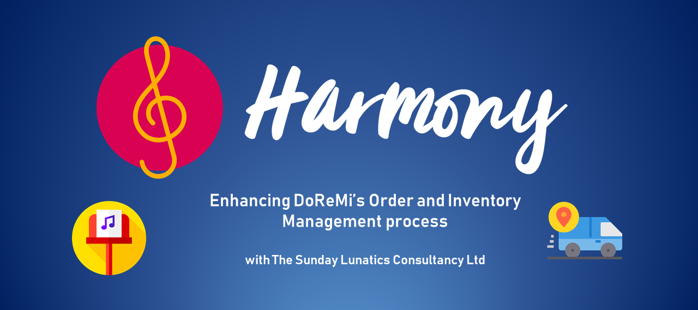

---

## SECTION 1 : PROJECT TITLE
## Harmony: Enhancing DoReMi's Order and Inventory Management process

---
## SECTION 2 : EXECUTIVE SUMMARY / PAPER ABSTRACT
The pervasive shift of retail towards e-commerce is threatening the existence of traditional  brick and mortar businesses. DoReMi, a specialized music retailer, faces an uphill challenge in dealing with the forces of change and finds itself in a precarious situation. Several factors, namely its lack of product diversification, limited channels of purchase and its limited adoption of technology exacerbates DoReMi’s current situation. If DoReMi fails to address existing internal challenges, it will be ill equipped to survive in the digital era.

The Sunday Lunatics (TSL) is engaged to provide consultancy services to identify areas of improvements for DoReMi and solutions to help propel DoReMi into the ecommerce space. Through extensive information gathering with the staff of DoReMi, TSL has converted years of tacit knowledge into documented knowledge models. TSL has proposed new business workflows leveraging on the Knowledge Models developed, to enable faster decision making and more timely delivery of orders. The completion of the entire project can help DoReMi achieve cost savings through value creation from process automation and upskilling of workforce as well as value add in productivity from the overall enhanced efficiency and supply chain management.

Due to the diverse nature and complexity of implementation, TSL recommends a phased approach towards the implementation of Harmony. The challenges related to Sales & Pricing and Logistics & Supply Chain Management are assessed to be more critical and TSL recommends prioritizing these challenges. The remaining challenges relating to Point-of-Sale system and detailed Project Management will be addressed in subsequent phases of the consultancy.

The objective of Harmony, the Proof of Concept (POC) solution for the Order Handling and Inventory Restock processes in the initial phase is to demonstrate the implementation of the knowledge models and seek validation from DoReMi management to proceed with the next phase. Through the proposed workflows, TSL is able to execute sophisticated business rules, incorporating a multitude of factors, in automated and efficient manner. Through this, manual intervention is significantly reduced as complex decision making is offloaded to our system. This means that DoReMi staff is able to focus on higher order thinking tasks. The proposed business processes also seek to prepare DoReMi for new Inventory management concepts such as ‘Just In Time’ inventory, where no or limited inventory to stored,allowing DoReMi to save on warehousing costs. 

The technologies used in our POC solution are a combination of Angular, Drools and java Business Process Model (jBPM).

---
## SECTION 3 : CREDITS / PROJECT CONTRIBUTION

| Official Full Name  | Student ID  | Work Items | 
| :------------ |:---------------:| :-----| 
| Tan Jun Khiang | A0195169N | Project Report, Knowledge Modelling and Drools| 
| Tan Wei Lian, William | A0048135J | Environment Set Up, JBPM|
| Tang Meng | A0137099U | Angular Web Application,JBPM| 
| Leong Jun Hun, Darryl | A0195318X | Project Report, Knowledge Modelling and Drools| 

---
## SECTION 4 : VIDEO OF SYSTEM MODELLING & USE CASE DEMO

Note: It is not mandatory for every project member to appear in video presentation; Presentation by one project member is acceptable. 
More reference video presentations [here](https://telescopeuser.wordpress.com/2018/03/31/master-of-technology-solution-know-how-video-index-2/ "video presentations")

---
## SECTION 5 : USER GUIDE

`<Github File Link>` : <https://github.com/telescopeuser/Workshop-Project-Submission-Template/blob/master/UserGuide/User%20Guide%20HDB-BTO.pdf>

### [ 1 ] To run the system in Linux Server

> open terminal/git bash

> $ git clone //todo:git_url

> unzip folder

> $ cd folder_location/DoRemi-service

> make sure maven installed

> $ ./launch.sh clean install

> **Go to URL using web browser** Should be able to see a page with content "DoReMi-service-1.0-SNAPSHOT" via http://localhost:8090 

> $ cd folder_locatioin/ang-doremi

> $ npm install -g @angular/cli

> $ npm install

> $ ng serve --open

> **Go to URL using web browser** http://localhost:4200

---
## SECTION 6 : PROJECT REPORT / PAPER

`<Github File Link>` : <https://github.com/telescopeuser/Workshop-Project-Submission-Template/blob/master/ProjectReport/Project%20Report%20HDB-BTO.pdf>

**Recommended Sections for Project Report / Paper:**
- Executive Summary / Paper Abstract
- Sponsor Company Introduction (if applicable)
- Business Problem Background
- Project Objectives & Success Measurements
- Project Solution (To detail domain modelling & system design.)
- Project Implementation (To detail system development & testing approach.)
- Project Performance & Validation (To prove project objectives are met.)
- Project Conclusions: Findings & Recommendation
- List of Abbreviations (if applicable)
- References (if applicable)

---
## SECTION 7 : MISCELLANEOUS

### HDB_BTO_SURVEY.xlsx
* Results of survey
* Insights derived, which were subsequently used in our system

---

**This [Machine Reasoning (MR)](https://www.iss.nus.edu.sg/executive-education/course/detail/machine-reasoning "Machine Reasoning") course is part of the Analytics and Intelligent Systems and Graduate Certificate in [Intelligent Reasoning Systems (IRS)](https://www.iss.nus.edu.sg/stackable-certificate-programmes/intelligent-systems "Intelligent Reasoning Systems") series offered by [NUS-ISS](https://www.iss.nus.edu.sg "Institute of Systems Science, National University of Singapore").**

**Lecturer: [GU Zhan (Sam)](https://www.iss.nus.edu.sg/about-us/staff/detail/201/GU%20Zhan "GU Zhan (Sam)")**

**zhan.gu@nus.edu.sg**
